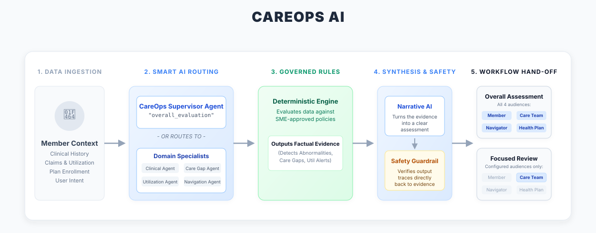
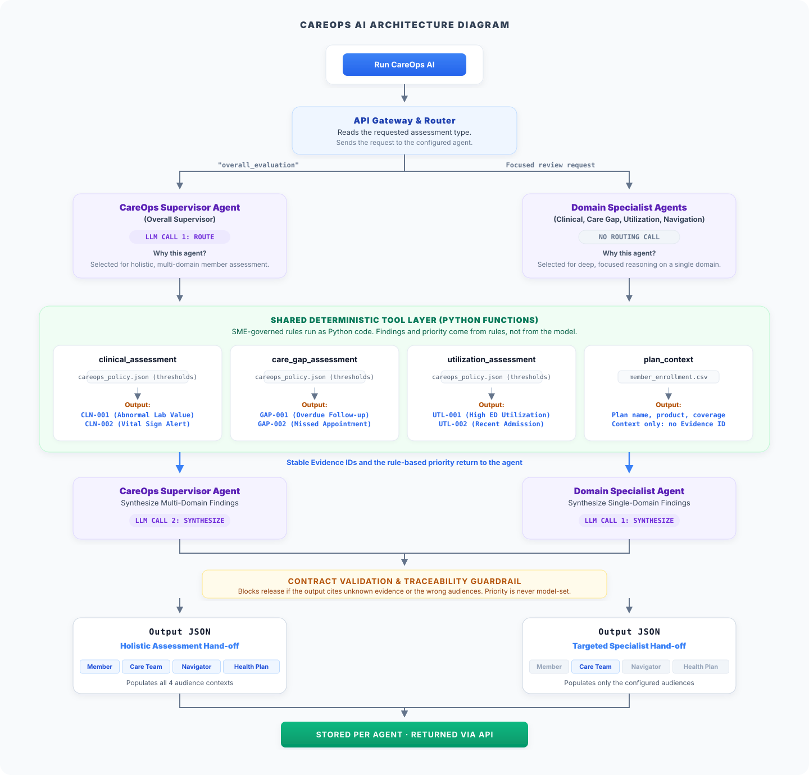

# CareOps

<p align="center">
  <strong>Evidence-backed AI decision support for turning complex member data into clear, actionable decisions.</strong>
</p>

<p align="center">
  
  
  
  
  
  
</p>

---

## Table of Contents

- [CareOps](#careops)
  - [Table of Contents](#table-of-contents)
  - [Overview](#overview)
- [Architecture](#architecture)
  - [Business Architecture](#business-architecture)
  - [Technical Architecture](#technical-architecture)
- [Agent Model](#agent-model)
- [Decision Model](#decision-model)
- [Evidence \& Policy](#evidence--policy)
- [Decision Contract](#decision-contract)
- [Persistence](#persistence)
- [Project Structure](#project-structure)
  - [Package Responsibilities](#package-responsibilities)
- [Technology Stack](#technology-stack)
- [Getting Started](#getting-started)
  - [Prerequisites](#prerequisites)
    - [Install](#install)
    - [Configure Environment](#configure-environment)
- [Running CareOps](#running-careops)
  - [Streamlit](#streamlit)
  - [FastAPI](#fastapi)
- [Development Principles](#development-principles)
- [Scope \& Limitations](#scope--limitations)
- [Contact](#contact)

---

## Overview

**CareOps** is an AI-assisted decision-support platform that evaluates member and operational data, identifies meaningful findings, and converts them into structured, evidence-backed actions.

The core principle is:

> **Deterministic logic determines what was found. AI explains the findings and translates them into an actionable decision.**

This creates a consistent flow:

```text
Data → Findings → Evidence → Decision → Action
```

A completed assessment is represented as a **reusable decision contract**, rather than an isolated AI response or dashboard view.

---

# Architecture

CareOps separates the deterministic decision layer from AI reasoning and presentation.

### Business Architecture

<p align="center">
  
</p>

### Technical Architecture

<p align="center">
  
</p>

---

# Agent Model

CareOps supports a supervisor-and-specialist assessment pattern.

| Assessment  | Agent                        | Focus                       |
| ----------- | ---------------------------- | --------------------------- |
| Overall     | **CareOps Supervisor** | Multi-domain assessment     |
| Clinical    | **Clinical Review**    | Clinical signals            |
| Care Gaps   | **Care Gap Review**    | Missed / overdue care       |
| Utilization | **Utilization Review** | Utilization activity        |
| Navigation  | **Navigation Review**  | Plan and navigation context |

Specialist assessments operate on the same underlying decision model while tailoring the output to their operational context.

---

# Decision Model

The deterministic layer evaluates source data using configurable rules and thresholds.

Current domains include:

```text
clinical_assessment
care_gap_assessment
utilization_assessment
plan_context
```

Example findings:

```text
CLN-001   Abnormal Lab Value
CLN-002   Vital Sign Alert

GAP-001   Overdue Follow-up
GAP-002   Missed Appointment

UTL-001   High ED Utilization
UTL-002   Recent Admission
```

The resulting chain remains traceable:

```text
Observation
    ↓
Rule / Threshold
    ↓
Finding
    ↓
Evidence ID
    ↓
Priority
```

AI operates on these structured results to produce explanations, recommendations, and stakeholder-specific communication.

---

# Evidence & Policy

Business thresholds and evidence relationships are maintained through configurable policy rather than being scattered across application code.

```text
data/
├── careops_policy.json
└── careops_policy.example.json
```

The policy model defines:

| Component                   | Purpose                                       |
| --------------------------- | --------------------------------------------- |
| **Thresholds**        | Determine when observations become findings   |
| **Evidence Catalog**  | Define Evidence IDs and their meaning         |
| **Evidence Patterns** | Connect evidence combinations to implications |

This allows policy to evolve independently of the core execution framework.

---

# Decision Contract

A completed run produces a structured decision:

```text
Decision
├── Member Context
├── Priority
├── Findings
│   ├── Evidence
│   └── Implication
├── Recommended Actions
├── Stakeholder Views
└── Run Metadata
```

The same decision can be presented for different audiences:

```text
Member
Care Team
Navigator
Health Plan
```

AI output is validated against the expected contract before it is released.

---

# Persistence

Assessment runs are stored by agent:

```text
data/
└── runs/
    └── <agent_key>/
        ├── runs.parquet
        ├── findings.parquet
        └── actions.parquet
```

All records are related through `run_id`.

Persisted results can be reused when the relevant member data, policy, and execution context are unchanged. A **Fresh Run** can be requested when a new execution is required.

---

# Project Structure

```text
CareOps/
│
├── app.py
├── pyproject.toml
├── uv.lock
├── .env.example
│
├── assets/
│   ├── logo.svg
│   ├── logo_mark.svg
│   ├── style.css
│   └── diagrams/
│
├── backend/
│   ├── api.py
│   ├── schemas.py
│   └── README.md
│
├── data/
│   ├── patients.csv
│   ├── claims.csv
│   ├── member_enrollment.csv
│   └── careops_policy*.json
│
├── frontend/
│   ├── runtime.py
│   ├── ui.py
│   └── pages/
│
└── src/careops/
    ├── application/
    ├── contracts/
    ├── domains/
    ├── infrastructure/
    └── orchestration/
```

### Package Responsibilities

| Package             | Responsibility                     |
| ------------------- | ---------------------------------- |
| `frontend/`       | Streamlit UI                       |
| `backend/`        | FastAPI interface                  |
| `application/`    | Application orchestration          |
| `contracts/`      | Typed data and API contracts       |
| `domains/`        | Deterministic business logic       |
| `orchestration/`  | Agents and AI execution            |
| `infrastructure/` | AI runtime and persistence         |
| `data/`           | Demo data and policy               |
| `assets/`         | Branding and architecture diagrams |

---

# Technology Stack

| Layer              | Technology                           |
| ------------------ | ------------------------------------ |
| UI                 | Streamlit                            |
| API                | FastAPI                              |
| Validation         | Pydantic                             |
| Data               | Pandas                               |
| Persistence        | Parquet                              |
| AI                 | LangChain-based provider abstraction |
| Configuration      | Environment variables + JSON         |
| Styling            | CSS + SVG                            |
| Package Management | `uv`                               |
| Runtime            | Python 3.13+                         |

---

# Getting Started

## Prerequisites

* Python **3.13+**
* [`uv`](https://docs.astral.sh/uv/)
* Credentials for the configured AI provider

### Install

```bash
git clone https://github.com/shib1111111/CareOps.git
cd CareOps

uv sync
```

Or:

```bash
python -m pip install -e .
```

### Configure Environment

**Windows**

```powershell
copy .env.example .env
```

**macOS / Linux**

```bash
cp .env.example .env
```

Configure the required provider settings:

```env
LLM_PROVIDER=<provider>
LLM_MODEL=<model>
<PROVIDER_API_KEY>=<your-api-key>
```

Keep credentials outside source control.

---

# Running CareOps

### Streamlit

```bash
uv run streamlit run app.py
```

### FastAPI

```bash
uv run uvicorn backend.api:app --reload
```

Primary API endpoints:

```text
GET  /health
GET  /ready

POST /api/v1/assessments
GET  /api/v1/assessments/{id}
```

Detailed API documentation is available in [`backend/README.md`](backend/README.md).

---

# Development Principles

* **Deterministic core** — business findings are generated through explicit rules.
* **Evidence-backed AI** — AI works from structured findings rather than inventing the underlying decision.
* **Typed contracts** — core interfaces use explicit Pydantic models.
* **Configuration over hard-coding** — thresholds and evidence mappings are policy-driven.
* **Separation of concerns** — UI, domain logic, AI orchestration, and infrastructure remain independently structured.
* **Traceability** — decisions can be connected back to findings, evidence, policy, and run metadata.

---

# Scope & Limitations

CareOps currently demonstrates:

* Multi-domain assessment
* Supervisor and specialist agents
* Deterministic assessment logic
* Configurable policy and evidence
* AI-assisted decision synthesis
* Contract validation
* Stakeholder-specific outputs
* Persisted and reusable runs
* Streamlit UI
* FastAPI interface

> **CareOps is a proof of concept using demonstration data and policies. It is not intended to independently diagnose, treat, or make clinical decisions.**

A production deployment would require appropriate security, IAM, privacy and data governance, auditability, observability, resilient infrastructure, domain governance, and operational controls.

---

# Contact

**Shib Kumar Saraf**

* Email: [shibkumarsaraf05@gmail.com](mailto:shibkumarsaraf05@gmail.com)
* GitHub: [github.com/shib1111111](https://github.com/shib1111111)

<p align="center">
  <sub>CareOps · From complex data to actionable decisions.</sub>
</p>
